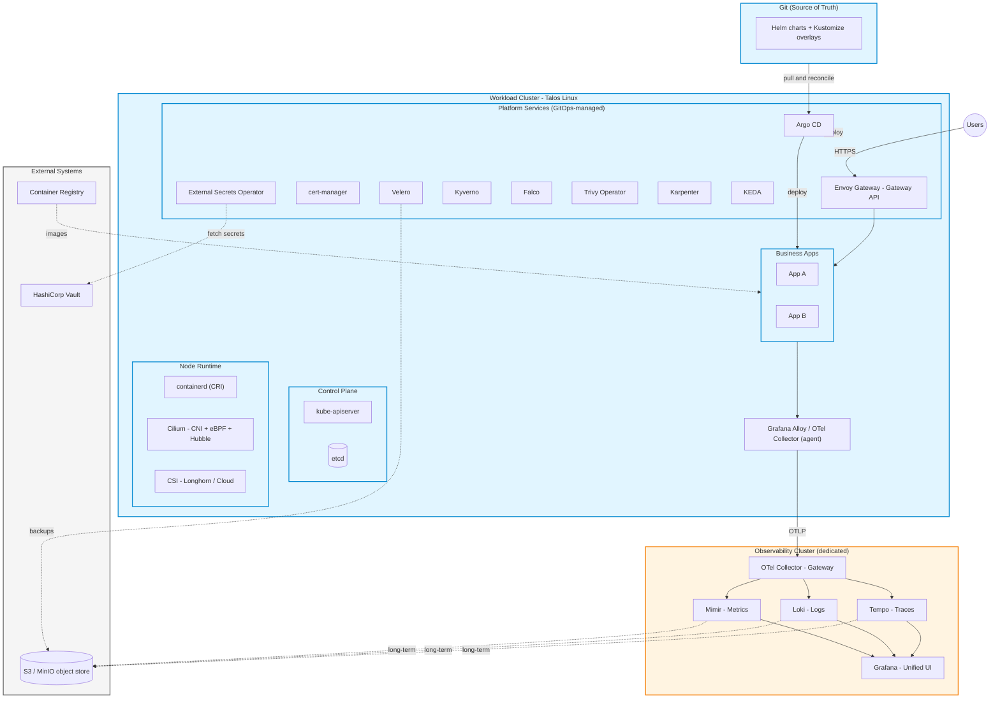

```mermaid
flowchart TB
    subgraph GIT["Git (Source of Truth)"]
        MANIFESTS[Helm charts + Kustomize overlays]
    end

    subgraph WL["Workload Cluster - Talos Linux"]
        direction TB

        subgraph CP[Control Plane]
            API[kube-apiserver]
            ETCD[(etcd)]
        end

        subgraph RUNTIME["Node Runtime"]
            CRI["containerd (CRI)"]
            CNI["Cilium - CNI + eBPF + Hubble"]
            CSI["CSI - Longhorn / Cloud"]
        end

        subgraph PLATFORM["Platform Services (GitOps-managed)"]
            ARGO[Argo CD]
            GW["Envoy Gateway - Gateway API"]
            CERT[cert-manager]
            ESO[External Secrets Operator]
            KYV[Kyverno]
            FALCO[Falco]
            TRIVY[Trivy Operator]
            KARP[Karpenter]
            KEDA[KEDA]
            VELERO[Velero]
        end

        subgraph APPS[Business Apps]
            A1[App A]
            A2[App B]
        end

        ALLOY["Grafana Alloy / OTel Collector (agent)"]
    end

    subgraph OBS["Observability Cluster (dedicated)"]
        direction TB
        OTELG[OTel Collector - Gateway]
        MIMIR[Mimir - Metrics]
        LOKI[Loki - Logs]
        TEMPO[Tempo - Traces]
        GRAF[Grafana - Unified UI]

        OTELG --> MIMIR
        OTELG --> LOKI
        OTELG --> TEMPO
        MIMIR --> GRAF
        LOKI --> GRAF
        TEMPO --> GRAF
    end

    subgraph EXT["External Systems"]
        S3[("S3 / MinIO object store")]
        VAULT[HashiCorp Vault]
        REG[Container Registry]
    end

    GIT -->|pull and reconcile| ARGO
    ARGO -->|deploy| APPS
    ARGO -->|deploy| PLATFORM

    APPS --> ALLOY
    ALLOY -->|OTLP| OTELG

    ESO -.->|fetch secrets| VAULT
    VELERO -.->|backups| S3
    MIMIR -.->|long-term| S3
    LOKI -.->|long-term| S3
    TEMPO -.->|long-term| S3

    Users((Users)) -->|HTTPS| GW
    GW --> APPS
    REG -.->|images| APPS

    classDef cluster fill:#e1f5ff,stroke:#0288d1,stroke-width:2px
    classDef obs fill:#fff4e1,stroke:#f57c00,stroke-width:2px
    classDef ext fill:#f5f5f5,stroke:#666
    class WL cluster
    class OBS obs
    class EXT ext

```